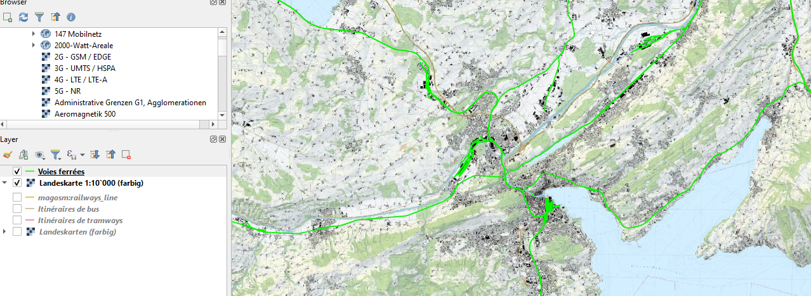
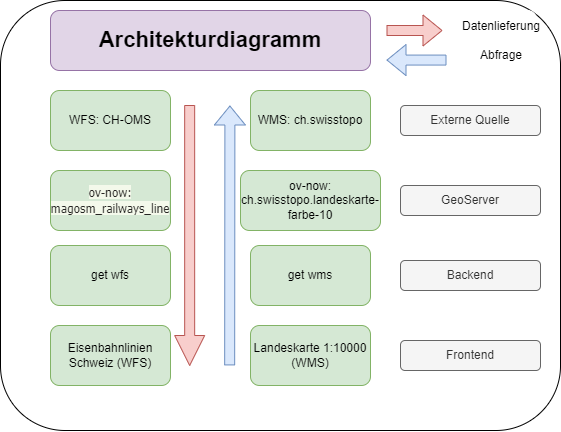

# Dokumentation

## Layersuche
Für WMS, also für die Hintergrundkarte, wurde die Datenbank von swisstopo verwendet.
Für WFS wurde der Dienst ch-oms verwendet([https://ch-osm.geodatasolutions.ch/de/diensten/](https://ch-osm.geodatasolutions.ch/de/diensten/))

Es wurden folgende Layer ausgewählt:
- Landeskarte 1:10'000 (farbig)
- Eisenbahnlinien

Die beiden Layer wurden in QGIS eingebunden und getestet.



## Geoserver
Zuerst wurde ein neuer Arbeitsbereich ov-now erstellt. Anschliessend wurden die beiden Layer über Datenquelle hinzufügen in Geoserver ergänzt.

Danach wurde die Verbindung getestet. Die Layervorschau wurden geöffnet.


Über eine Beispielabfrage [http://localhost:8080/geoserver/wms?service=WMS&version=1.1.0&request=GetMap&layers=ov-now:ch.swisstopo.landeskarte-farbe-10&bbox=909906.3847,5934112.2539,950876.6319,5964839.9393&width=800&height=600&srs=EPSG:3857&format=image/png](http://localhost:8080/geoserver/wms?service=WMS&version=1.1.0&request=GetMap&layers=ov-now:ch.swisstopo.landeskarte-farbe-10&bbox=909906.3847,5934112.2539,950876.6319,5964839.9393&width=800&height=600&srs=EPSG:3857&format=image/png) konnte nachgewiesen werden, dass Einbindung der Layer funktioniert.


## Backend
 Das Repository wurde geclont, jedoch wurde die Dateien backend.py und mapwrapper.jsx neu aufgesetzt. Dabei wurden für beide Typen im Backend eine Funktion erstellt.

 Anschliessend wurde die korrekte Einbindung getestet über eine Beispielabfrage im Browser.
 http://localhost:8000/wms?layers=ov-now:ch.swisstopo.landeskarte-farbe-10&bbox=909906.3847,5934112.2539,950876.6319,5964839.9393&width=800&height=600&srs=EPSG:3857&format=image/png

## Frontend
Durch geeignete Funktionen im mapwrapper.jsx kann das Frontend auf die Dienste zugreifen. 

Für den WMS-Layer wurde eine Checkbox erstellt, welche durch Aktivierung die OMS-Basiskarte überdeckt. Diese Funktion funktionierte lange nicht. Durch Ergänzen des Parameters alias konnte bei Abfragen auch Parameterschreibweisen hinzugezügt werden. Ausserdem musste wegen CORS-Problemen Dateien im Geoserver-Ordner angepasst werden. 

Beim WFS-Layer wurden zwei Buttons implementiert, um die Abfrage der Linien zu steuern. Dies wurde umgesetzt, da zuvor stehts eine Abfrage durchgeführt und weil dansch leicht herausgezoomt wurde, startete wieder eine Abfrage.


## Datenflussdiagramm
Vorher


Nachher



## Reflexion
Bei der Umsetzung lag der Fokus auf der Einbindung des GeoServers. Dadurch wurden die Funktionalitäten der App vernachlässigt.

Im Vergleich zum ursprünglichen Projekt hat die Integration von GeoServer viele Verbesserungen gebracht. Vorher waren Karten und geographische Daten statisch eingebunden, was wenig Flexibilität bot. Durch GeoServer kann man nun diese Daten nun dynamisch anzeigen und in Echtzeit aktualisieren. Das bedeutet, dass die Karten immer aktuell sind und genaue Informationen liefern.

Die Verwaltung der Geodaten ist nun viel effizienter. Mit GeoServer kann man die Daten besser organisieren und leichter aktualisieren. Dadurch werden Projekte insgesamt anpassbarer und skalierbarer. Wenn später weitere Geodienste hinzukommen, können diese ohne grosse Änderungen eingebunden werden.

Natürlich gab es bei der Einführung von GeoServer auch Herausforderungen, etwa bei der korrekten Handhabung der BBOX-Parameter. Zudem gab es Probleme bezüglich CORS, welche welche durch Ergänzung von Filtern im Web.xml-File behoben wurden. Die anderen Schwierigkeiten wurden durch gezielte Anpassungen im Frontend und Backend gelöst. Das Ergebnis ist eine deutlich verbesserte Sichtbarkeit und Darstellung der Geodaten.

Insgesamt hat GeoServer das Projekt von einer starren zu einem dynamischen und interaktiven Geodatenportel weiterentwickelt. Diese Veränderungen machen das Projekt nicht nur flexibler, sondern auch zukunftssicherer, da es nun auf eine robustere Basis gestellt ist, die leicht erweitert und angepasst werden kann.


# ÖV-Now

## Beschreibung
ÖV-Now ist eine App, die Sie über den Verkehr auf dem Laufenden hält, so dass Sie immer die beste Route wählen können.
Die Details entnehmen sie unserer GitHub [Page](Mattia-V01.github.io/ov-now/)


## Installation
1. Klone das Repository auf deinen Computer:
   ```
   git clone git@github.com:benutzername/ov-now.git
   ```
2. Navigiere in das Hauptverzeichnis des Projekts:
   ```
   cd ..\ov-now\client
   ```
3. Installiere die Abhängigkeiten:
   ```
   npm install
   ```

## Konfiguration
löschen vor Abgabe wenn nichts reinkommt.

## Backend
diese Anleitung richtet sich an die Inbetriebnahme des Backends auf dem Raspberry 4 des IGEO:

1.) Raspi starten udn einrichten, d.h. Internetverbindung aufbauen (in diesem Fall mit Handy HotSpot da Raspy nicht ins FH-Netz kommt)

2.) Bash öffnen und zu gewünschtem Root-Verzeichnis navigieren (cd /home/USER/documents)

3.) git clone https://github.com/Mattia-V01/ov-now.git

4.) python -m venv backend

5.) source backend/bin/activate

6.) sudo apt-get install python3-dev

7.) pip install --upgrade setuptools

8.) pip3 install starlette

9.) pip3 install fastapi

10.) pip3 install uvicorn

11.) pip3 install requests

12.) python cd /home/USER/documents/ov-now/server/app/backend.py
-> Beispielabfragen aus den Comments kopieren und ausprobieren. (wobei Beispielabfrage für Endpoint1 18minuten dauerte)


13.) sudo raspi-config 
SSH aktivieren

14.) setup SSH Verbindung: ip a 
unter drittens wlan0 inet ist die ip zu finden

15.) cd ov-now/server/app

16.) uvicorn backend:app --host 0.0.0.0 --port 8000

##nutzendes Gerät

50.) Auf nutzendem Gerät: cmd öffnen und eingeben:
ssh kuhnt@192.168.126.44
password = password

51.) hostname -I
gibt IP zurück falls nicht vorhanden zum Copy Pasten

51.)  "http://192.168.126.44:8000/get_all_journey/?bbox=838667,5997631,909982,6036843&key=5cc87b12d7c5370001c1d65576ce5bd4be5a4a349ca401cdd7cac1ff&zoom=12"

52.)  "http://192.168.126.44:8000/get_info/?train_id=sbb_140523186358112&key=5cc87b12d7c5370001c1d65576ce5bd4be5a4a349ca401cdd7cac1ff"


## Verwendung
1. Öffne deinen Browser und gehe zu `http://localhost:3000`.

