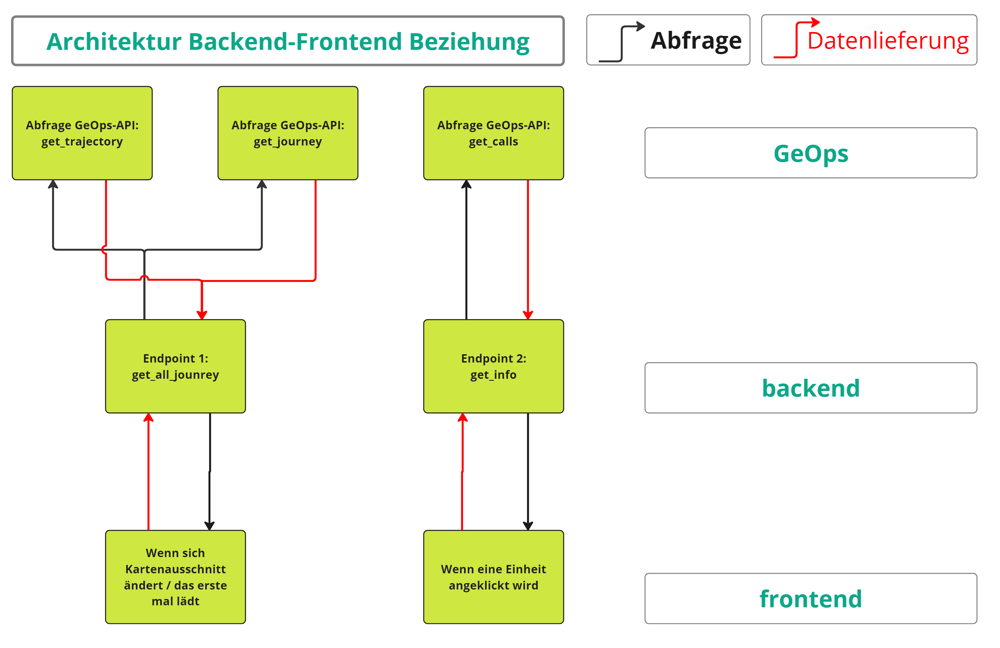
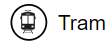
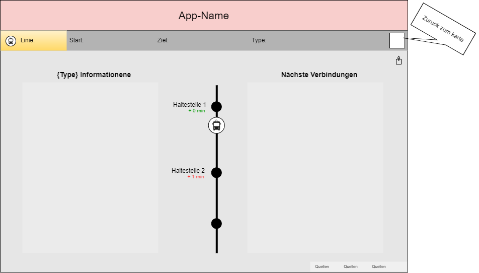
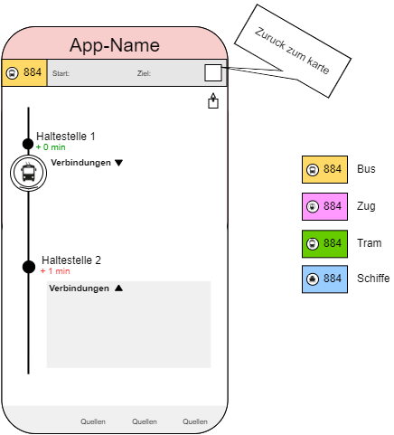
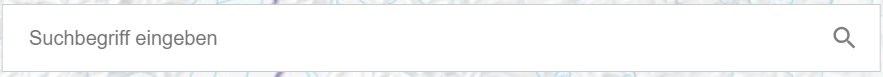

# ÖV-Now
## Motivation {#motivation}

Wir haben festgestellt, dass jemand, der sich die Informationen in der SBB-App anschaut, keine visuelle Bestätigung dafür hat, wo sich das öffentliche Verkehrsmittel, mit dem er unterwegs ist, in der Realität befindet. Dies kann zu Schwierigkeiten bei der Auswahl der besten Verbindungen führen, um das Ziel so einfach wie möglich zu erreichen.

## Ziel {#ziel}

Das Ziel dieses Projekts ist es, ein Geoportal zu schaffen, das die Visualisierung von Live-Daten aller Verkehrsmittel in der Schweiz ermöglicht. Dies wird die Wahl der Routen erleichtern, um Verspätungen zu vermeiden und mögliche unvorhergesehene Zwischenfälle zu beheben.

## Workflow {#workflow}

Für die Umsetzung der App wurde beschlossen, das Projekt in drei große Untergruppen aufzuteilen, eine für jedes Teammitglied:
- **Frontend**
- **Backend**
- **Verbindung zwischen Frontend und Backend**

**Planung und Konzeptentwicklung**

Nachdem die Aufgaben festgelegt wurden, begann die eigentliche Projektplanung mit einem Zeitplan und der Ausarbeitung eines Konzepts. In dieser Anfangsphase des Projekts wurde eine erste Idee entwickelt, wie die App aussehen sollte, einschließlich eines ersten GUI-Designs, möglicher Benutzer, der groben Struktur der gesamten App und der Entscheidung, welche Programmiersprachen verwendet werden sollen.
Parallel dazu wurden alle notwendigen Daten und Geodaten für das Gelingen des Projekts recherchiert.

**Umsetzung der App**

Nach Abschluss der Vorbereitungsphase wurde mit der eigentlichen Erstellung der App begonnen. Ausgehend von einem Basisprojekt von GDI mit OpenLayers wurden die verschiedenen visuellen Komponenten und die gesamte Struktur entwickelt, die das Funktionieren der App ermöglicht.

Darüber hinaus wurden die Daten so aufbereitet, dass sie innerhalb der App verwendet werden können.

**Abschlussphase und Tests**

In der letzten Phase des Projekts wurden die Daten vom Backend mit dem Frontend verbunden und die App wurde getestet, um sicherzustellen, dass alles wie gewünscht funktioniert.

## ÖV-Now im Konkreten {#app}
### Architectur {#architektur}

{: style="display:block; margin: 0 auto;"}

### Datenbankmodell {#Datenbankmodell}

Die wichtigsten Daten des Projekts (die Trajektorien der Verkehrsmittel) werden direkt geOps via API abgerufen. 
Währenddessen wurde PG Admin 4 für die Erstellung einer Datenbank verwendet, die die für den Betrieb der Suchleiste benötigten Daten enthält. Zurzeit ist nur eine Tabelle mit Daten aus swisstlm3D enthalten, nämlich der Punkte-Layer mit Informationen zu allen Haltenstellen in der Schweiz.

### Programmiersprachen {#Programmiersprachen}

Hauptsächlich wurden 2 Programmiersprachen verwendet.
Die erste ist Javascript mit der Unterstützung von React. Diese Programmiersprache ermöglicht es, eine interaktive und dynamische Benutzeroberfläche für Desktop und Mobile zu erstellen. Dies ermöglichte es, auf dem hypothetischen Gerät, auf dem der Benutzer die App verwenden kann, flexibel zu bleiben.
Die zweite verwendete Programmiersprache ist Python. Sie ermöglichte die Erstellung der Skripte, aus denen das Backend besteht.

### Bezugssystem {#bezugssystem}
Die bezogenen Daten aus der API stehen im EPSG: 3857 (Web Mercator) zur Verfügung. Die Punktkoordinaten werden ohne Transformation verwendet und auf der Karte abgebildet.

### Anwendung {#anwendung}
<video width="250" height="auto" controls >
  <source src="assets/img/mobile_anwendung.mp4" type="video/mp4">
</video>
 
Wir gehen davon aus, dass die App vor allem von Menschen genutzt wird, die täglich mit Verkehrsmitteln unterwegs sind, und dass das Gerät, auf dem sie am häufigsten genutzt wird, das Mobiltelefon ist (Mobile).
Nach dem Öffnen der App können Sie auf der Karte nach dem gewünschten Verkehrsmittel suchen oder in der Suchleiste die entsprechenden Attribute eingeben.
Wenn Sie sich in einem Gebiet befinden, in dem die öffentlichen Verkehrsmittel stark frequentiert sind, können Sie über das Dropdown-Menü auf der linken Seite die anzuzeigenden Ebenen aktivieren oder deaktivieren.
Wenn Sie die gewünschte Linie oder das gewünschte Verkehrsmittel gefunden haben, können Sie darauf klicken. Sie werden auf eine neue Seite weitergeleitet, auf der Ihnen wie in der SBB App die Daten zur Linie und zum Verkehrsmittel angezeigt werden. Diese Daten können Verspätungen, Streckenänderungen, Zugausfälle und vieles mehr beinhalten.
Wenn Sie jemanden über Ihre Reise informieren möchten, z.B. weil Sie eine Verspätung haben oder eine Änderung eingetreten ist, können Sie den Link zur Seite mit einem einfachen Button teilen.
Sobald Sie die Informationsseite beendet haben, können Sie zur Karte zurückkehren, um die neuen Strecken anzuzeigen.

## Frontend {#frontend}

### Symbologie {#symbologie}
Um die Verkehrsmittel und die Strecken, auf denen sie verkehren, zu unterscheiden, wurden Symbole eingeführt.
Die Transportsymbole stammen aus der React-Komponentenbibliothek: Material UI. Genauer gesagt aus Material Icons.

  
  Buslinien

  
  Bus

  
  Zuglinien

  
  Zug

  
  Tramlinien

  
  Tram

  
  Schiffelinien

  
  Schiffe

### Website Konzept {#website-konzept}
Wir möchten, dass sich unsere App an den Stil der SBB-App anlehnt, so dass die Menschen bereits an den Stil gewöhnt sind und keine Schwierigkeiten haben, die Informationen zu finden.
Unabhängig vom Stil der SBB-App möchten wir, dass unsere App leicht zu lesen und für jeden zugänglich ist.

### Mainpage {#mainpage}
Die Oberfläche der Hauptseite (diejenige, auf die man gelangt, wenn man die App öffnet) hat die Karte in ihrem Zentrum, sie dient als Hintergrund der App, muss aber auch im Mittelpunkt der Aufmerksamkeit des Nutzers stehen.
Aus diesem Grund wurden alle zusätzlichen Funktionen wie Ebenen und die Suchleiste an den Seiten des Bildschirms angebracht.
Bei der Anwendung wird zwischen einer Desktop- und einer mobilen Version unterschieden.

{: style="display:block; margin: 0 auto;"}
In der Desktop-Version wurde versucht, die Komponenten mit eckigen Formen darzustellen, um die Ähnlichkeit mit der Bildschirmform von Laptops oder PCs zu erhalten.

{: style="display:block; margin: 0 auto;"}
Im Gegensatz dazu haben die Bildschirme von Smartphones in der Regel eine eher runde Form.

Hoch über der Karte steht der Name der App auf rotem Hintergrund. Der Hintergrund soll an den Stil der SBB-App erinnern.
Alles in allem kann man von einem minimalistischen GUI sprechen, die das Lesen für die Nutzer nicht erschwert.

### Infopage {#infopage}
Auf dieser Seite werden die Daten der gewünschten Route dargestellt, diese Daten müssen im Mittelpunkt stehen.
Auch auf dieser Seite wurde, wie auf der Hauptseite, die Ähnlichkeit der Komponenten mit der Form des Bildschirms gesucht.

{: style="display:block; margin: 0 auto;"}
Oben finden Sie die allgemeinen Daten der Linie, wie z. B. die Liniennummer, die Art des Verkehrsmittels, den Abfahrts- und Ankunftsort.

{: style="display:block; margin: 0 auto;"}
Im Hauptteil finden Sie ein Liniendiagramm, das alle Bahnhöfe auf der Strecke mit eventuellen Verspätungen anzeigt, ausserdem können Sie die Verbindungen für jeden Bahnhof einsehen.
Die Farben Grün und Rot zeigen an, ob das Verkehrsmittel normal oder mit Verspätung verkehrt.
Vorerst nur eine Idee, es ist auch geplant, die verschiedenen Verkehrsmittel mit einem anderen Hintergrund darzustellen. Dadurch soll der Benutzer auf einen Blick erkennen, um welches Verkehrsmittel es sich handelt.

### Features {#feature}

**Hintergrundkarte**

Die `BackgroundButton`-Komponente ist ein vielseitiges und interaktives Element, das die Benutzererfahrung verbessert, indem es dynamische Hintergrundänderungen auf einer Karte ermöglicht. Diese Komponente ist mit React erstellt und integriert sich nahtlos mit OpenLayers zur Kartendarstellung.

**Hauptfunktionen**

- **Dynamisches Hintergrundwechseln**: Benutzer können zwischen verschiedenen Hintergrundkarten wechseln, einschliesslich farbiger und grauer Karten, Luftbilder und OpenStreetMap.
- **Reaktionsfähiges Menü**: Die Komponente enthält ein reaktionsfähiges Dropdown-Menü, das verschiedene Hintergrundoptionen als klickbare Bilder anzeigt.
- **Effizientes Layer-Management**: Es wird sichergestellt, dass der vorherige Hintergrund-Layer entfernt wird, bevor ein neuer hinzugefügt wird, um die optimale Kartenleistung zu erhalten.
- **GeoData-Abruf**: Nach dem Ändern des Hintergrunds ruft die Komponente die relevanten Geodaten für den ausgewählten Hintergrundtyp ab und aktualisiert sie.

**Detaillierte Beschreibung**

1. **State-Management**: Verwendet React's `useState`, um den Zustand des Dropdown-Menüs (`menuOpen`) zu verwalten.
2. **Ereignisbehandlung**: Die Funktion `toggleMenu` schaltet die Sichtbarkeit des Dropdown-Menüs um, während `handleBackgroundChange` den Hintergrundwechsel und den Datenabruf verwaltet.
3. **Layer-Entfernung**: Die Funktion `removeBackgroundLayer` stellt sicher, dass der vorherige Hintergrund-Layer entfernt wird, um Stapelung und Leistungsprobleme zu vermeiden.
4. **Hintergrundbild-Quelle**: Die Funktion `backgroundImageSrc` gibt basierend auf dem ausgewählten Kartentyp die entsprechende Bildquelle zurück.

Mit dieser Komponente können Sie aus 4 Arten von Hintergründen wählen. Zur Auswahl stehen: die nationale Farbkarte, die schwarz-weiße Karte, Luftbilder und die Openstreetmap-Basiskarte.
Für die ersten drei werden die von Swisstopo bereitgestellten wms verwendet.
<video width="250" height="auto" controls>
  <source src="assets/img/Sfondo_1.mp4" type="video/mp4">
</video>

**Layers**

Diese React-Komponente, `DropdownChecklist`, ist dafür ausgelegt, die Sichtbarkeit verschiedener Verkehrsebenen auf einer Kartenoberfläche zu verwalten. Sie enthält ein Dropdown-Menü mit Kontrollkästchen für Zug-, Bus-, Tram- und Fährenlinien, die jeweils mit einem Bild verknüpft sind.

**Merkmale**

- **Layer-Sichtbarkeitssteuerung**: Benutzer können die Sichtbarkeit der Verkehrsebenen (Zug, Bus, Tram, Fähre) über Kontrollkästchen umschalten.
- **Touch-Unterstützung**: Das Dropdown-Menü unterstützt Touch-Ereignisse, sodass Benutzer das Menü mit einer Rechtswischgeste öffnen können.
- **Dynamische Zustandsverwaltung**: Die Komponente verwendet den `useState`-Hook von React, um den Zustand der ausgewählten Elemente und den Öffnungs-/Schließzustand des Menüs zu verwalten.

**Komponentenstruktur**

- **Zustandsverwaltung**: `checkedItems` und `menuOpen` werden mit dem `useState`-Hook von React verwaltet.
- **Ereignis-Handler**:
  - `handleChange`: Aktualisiert den Zustand, wenn ein Kontrollkästchen umgeschaltet wird, und benachrichtigt die übergeordnete Komponente über `onLayerVisibilityChange`.
  - `handleToggle`: Schaltet den Öffnungs-/Schließzustand des Dropdown-Menüs um.
  - `handleTouchStart` und `handleTouchMove`: Behandeln Touch-Ereignisse, um das Menü mit einer Wischgeste zu öffnen.
  
- **DropdownCheckbox-Komponente**: Jede Verkehrsebene wird durch eine `DropdownCheckbox`-Komponente dargestellt, die Folgendes umfasst:
  - Ein Label
  - Ein Kontrollkästchen
  - Ein Bild, das den Verkehrstyp repräsentiert
  - Ein Anzeigetext für den Verkehrstyp

<video width="250" height="auto" controls>
  <source src="assets/img/Layers_1.mp4" type="video/mp4">
</video>

**Sharelink**

Mit dieser Komponente kann die Seitenurl an eine andere Person über Whatsapp gesendet werden.
Die Komponente wurde mit der react-share-Bibliothek erstellt, die bereits verschiedene Schaltflächen zum Teilen in sozialen Netzwerken bereitstellt.

{: style="display:block; margin: 0 auto;"}

**Suchleiste**

Es handelt sich um die neueste Funktion, an der derzeit gearbeitet wird und die noch nicht funktionsfähig ist.
Mit Hilfe eines Python-Skripts werden Daten aus der PG Admin-Datenbank importiert, die dann mit der Logik der Suchleiste verknüpft werden.
Wenn ein Benutzer den Namen einer Haltestelle eingibt, wird er gefragt, ob ein gleicher Wert im Attributfeld "Name" existiert. Wenn dies der Fall ist, wird der Punkt in der Karte zentriert. Wenn keine Merkmale gefunden werden, erscheint ein Popup mit der Meldung, dass keine Merkmale gefunden wurden. 
Ebenen
Interaktion mit Daten
Schaltfläche "Teilen
Mit dieser Komponente kann die URL der Seite per Whatsapp an eine andere Person gesendet werden.
Die Komponente wurde mit der React-Share-Bibliothek erstellt, die bereits verschiedene Schaltflächen zum Teilen auf sozialen Netzwerken bereitstellt.

{: style="display:block; margin: 0 auto;"}

## Von Backend bis Frontend {#Von-Backend-bis-Frontend}

## Backend {#backend}
### Datenherkunft {#Datenherkunft}
Zuerst wollten wir intuitiv die Daten von der SBB oder OpenData.ch beziehen. Leider sind alle diese API's etwas anderes als wir benötigen oder / und sie sind nicht zugänglich für nichts zahlende Studenten. So endeten wir bei GeoOps. 

### Limitationen in der Genauigkeit {#Limitationen1}
Die Positionierungsgenauigkeit ist uns nicht bekannt, ebenfalls ist uns nicht bekannt über welche Hard & Software die Positionierung erstellt wird.

Und wurde vom Opendata-Verantworlichen* der SBB bestätigt, was ebenfalls bei GeoOps im kleingedruckten steht: Die Aktuelle Position der Züge gibt es in Westeuropa nicht. Es gibt keinen Datensatz, der unseren Use-case tatsächlich abdeckt. 

*Kontakt konnte nur hergestellt werden indem auf GitHub ein Issue eröffnet wurde

Alle Vorbilder wie folgende sind sommit nicht akkurat. Das heisst die gezeigten Positionen sind nicht real, sondern nur Interpolationen aus den Streckenabschnitten, den Abfahrtszeiten und Verspätungen.
[https://maps.trafimage.ch/](https://maps.trafimage.ch/ch.sbb.netzkarte?baselayers=ch.sbb.netzkarte,ch.sbb.netzkarte.dark,ch.sbb.netzkarte.luftbild.group,ch.sbb.netzkarte.landeskarte,ch.sbb.netzkarte.landeskarte.grau&lang=de&layers=ch.sbb.puenktlichkeit-ferry,ch.sbb.puenktlichkeit-bus,ch.sbb.puenktlichkeit-tram,ch.sbb.puenktlichkeit-nv,ch.sbb.puenktlichkeit-fv,ch.sbb.ch_gemeinden,ch.sbb.netzkarte.buslinien,ch.sbb.bahnhofplaene.printprodukte&x=959424.28&y=5870241.48&z=9.46)
[https://www.map.signalbox.io/](https://www.map.signalbox.io/?train=202402276727821&location=@52.59865,-1.98746,9Z)
[https://mobility.portal.geops.io/](https://mobility.portal.geops.io/world.geops.transit?layers=paerke,strassennamen,haltekanten,haltestellen,pois,tramlinien,world.geops.traviclive&x=941076.59&y=5983545.01&z=9.18)

Wir haben auch keine Angaben zu der Genauigkeit temporalen Auflösung, wir werden jedoch selbst aus im nächsten Kapitel folgenden Gründen darauf beschränken, die Daten in grösseren Zeitlichen Abständen zu beziehen als für eine Produktive App eigentlich notwendig:

### Limitationen im Zugriff {#Limitationen2}
Da die SBB & OpenData -Spuren beide im Sand verliefen nutzen wir nun die Daten der [GeoOps-API](https://developer.geops.io/apis/realtime). Diese ist eigentlich eine kostenpflichtige API aber bietet eine gratis Testmöglichkeit nachdem man einen Account erstellt hat. Das Pricing ist in folgender Tabelle ersichtlich:

| SERVICE | UNIT | CREDITS |
|:------------------ |:-------------------:| -------------------:|
| Maps Standard | 1000 requests for vector tiles | 1 |
| Maps Raster | 1000 requests for raster map tiles | 10 |
| Routing | 1000 routing requests | 25 |
| Stops | 1000 search requests for stops | 10 |
| Realtime via Get | 1000 requests for vehicle position, stop times | 5 |
| Realtime via Websocket | 1000 minutes of open websocket connection | 50 |

Hierbei hat man 100 Credits pro Monat zur Verfüguung. Wir haben verschiedene Accounts die wir jeweils durchswapen können.

### alternative API {#alternative-API}

* allgemeine Zugstörungsinformationen oder alle anderen Daten der SBB auf diesem Portal über die folgenden Links:
https://data.sbb.ch/explore/dataset/rail-traffic-information/api/
https://data.sbb.ch/api/explore/v2.1/console
https://data.sbb.ch/explore/?sort=modified

* Haltestellen des öffentlichen Verkehres
https://www.geocat.ch/geonetwork/srv/ger/catalog.search#/metadata/841d42ff-8177-4e07-a96b-e8e5455ae048

### Endpoints {#endpoints}

Das backend.py ist das Backend, dass auf dem Server laufen kann und 2 Enpoints anbietet:
(Dazu einfach pip install fastAPI und die anderen Bibliotheken)
Im Code hat es in den Kommentaren Beispiel-Abfragen falls es im Localhost ausgeführt wird: 
http://localhost:8000/get_all_journey/?bbox=838667,5997631,909982,6036843&key=5cc87b12d7c5370001c1d65576ce5bd4be5a4a349ca401cdd7cac1ff&zoom=12
http://localhost:8000/get_info/?train_id=sbb_139707706285552&key=5cc87b12d7c5370001c1d65576ce5bd4be5a4a349ca401cdd7cac1ff

Im Ordner example_backend_endpoints gibt es für beide Abfragen Beispiele.
Beachtet dass das ausführen des ersten Endpoints bei grosser Bounding Box mehrere Minuten gehen kann

Der erste Endpoint get_all_journey soll aufgeruft werden sobald die App initialisiert wird. Mit der dargestellten Bounding Box wird das als String mit dem Zoom Level und dem Key an den Endpoint abgegeben, dieser ruft die GeOps-API get_trajectories auf und dann für jeden erhaltenen train_ID noch einmal die get_journey.

Der zweite Endpoint get_info gibt das die GeOps-Abfrage von get_calls zurück.

## Daten {#daten}

### Weiterverarbeitung {#Weiterverarbeitung}
Bei der Journeyabfrage werden alle Journey in der Bounding Box mit der Train_id abgefragt. Jenach Verkehrsmittel (type) werden nur die passenden Journey ausgewählt und anschliessend mit dem dazugehörigen Liniensymbol entlang der Koordinaten dargestellt.

Auf der InfoPage, welche durch einen Klick auf eine Linie erfolgt, werden die Daten des get_calls dargestellt. Diese Abfrage gibt für eine Train_id alle Haltestellen inklusiv Ankunfts- und Abfahrtszeiten an. Der Fahrtverlauf des Verkehrsmittels wird mit einer vertikalen Linie mit je einem Punkt für jede Haltestelle dargestellt. Für die aktuelle Position des Verkehrsmittels werden die Haltestellenzeiten mit der aktuellen Zeit verglichen und auf der Linie mit einem roten Punkt visualisiert. Haltestellen, deren Abfahrtszeit bereits vorbei ist, werden grau dargestellt.

## Quellen {#quellen}

ChatGPT (sowohl GPT-4o als auch GPT-3.5) wurde zur Untersuchung von Themen und für verschiedene Fehlerbehebungen verwendet.
Für die Übersetzung einiger Texte vom Italienischen ins Deutsche wurde die deepl-Desktop-Version verwendet.

